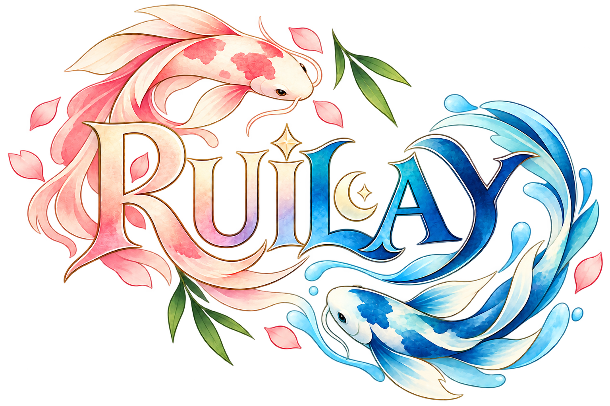

# Ruilay



> Sakura Garden, Bamboo Workshop ve Moon Shrine boyunca suyun akışını geri getirdiğin, Unity ile geliştirilen sakin ve hikâye odaklı bir boru bulmaca oyunu.

[](https://unity.com/)
[](https://learn.microsoft.com/dotnet/csharp/)
[](https://github.com/muhammedcanarica/PipeMuzzle)

## Türkçe

### Oyun fikri

Ruilay, Sakura Garden, Bamboo Workshop ve Moon Shrine boyunca geçen sakin ve hikâye odaklı bir su akışı bulmacasıdır. Oyuncu boruları 90 derecelik adımlarla döndürerek kaynaktan hedefe kesintisiz bir rota kurar; tamamlanan rotayı izleyen su akışı bölümü çözer.

Proje şu anda **pre-alpha / oynanabilir temel prototip** aşamasındadır. Sakura Garden, Bamboo Workshop ve Moon Shrine dünyalarında **12'şer bölüm, toplam 36 bölüm** bulunur. Dünya bazlı ilerleme ve 3/6/9/12 story checkpoint'leri korunur. Yeni zorluk eğrisi ve doğrulama ayrıntıları [level design raporundadır](docs/level-design-pass.md).

### Öne çıkan teknik özellikler

- Bit maskeleriyle temsil edilen dört yönlü boru bağlantıları
- Karo şekline ve dönüşüne göre dinamik bağlantı hesabı
- Kilitli karoları destekleyen 90° saat yönü dönüş sistemi
- Başarılı dönüşlerde event üzerinden güncellenen görünür hamle sayacı
- Kaynaktan hedefe ulaşılabilirliği kontrol eden BFS tabanlı bağlantı algoritması
- `ScriptableObject` tabanlı, tekrar kullanılabilir bölüm tanımları
- Bölüm verisini çalışma zamanı durumuna çeviren `BoardBuilder`
- Bölümdeki karoları prefab üzerinden üreten ve grid'i dünya merkezine yerleştiren `BoardView`
- Oluşturulan renderer sınırlarını, ekran oranını ve padding değerini kullanarak kamerayı otomatik ayarlayan `BoardCameraFitter`
- Karo şekline uygun pipe sprite'ını ve dönüşünü görsele uygulayan `TileView`
- `IPointerClickHandler` ve event zinciri üzerinden çalışan tıklama → animasyonlu döndürme → çözüm kontrolü akışı
- Source / Target rol ayrımı, kilitli karo tint'i ve Source'tan ulaşılabilir hatlarda powered görünümü
- Çözüm anında powered hat üzerinde kısa completion pulse geri bildirimi
- Gerçek Source → Target rotasını tile merkezlerinden takip eden enerji projectile / flow animasyonu
- `BoxCollider2D` destekli tile etkileşimi ve kilitli Source/Target kontrolü
- Bölüm çözüldükten sonra yeni tile inputlarını engelleyen tamamlama kilidi
- Her dünyanın 12 bölümünü sunan `LevelSelectUI`, World Map ve comic navigation; yeniden başlatma, bölüm bilgisi, hamle sayacı ve tamamlama panelini yöneten oyun UI'ı
- `PlayerPrefs` ile kalıcı tutulan level açılma ilerlemesi
- İlk Android APK denemesi için hazırlanan build yapılandırması
- Başarılı pipe dönüşünde procedural tick; target'a ulaşan flow tamamlandıktan sonra tek completion chime. `GameFeedback.SetSoundEnabled` ve `SetHapticsEnabled` tercihleri `PlayerPrefs` ile saklar. Android completion titreşimi 40 ms'dir; fiziksel cihaz doğrulaması bekler.

### Mimari

| Katman | Sorumluluk | Başlıca sınıflar |
| --- | --- | --- |
| `Data` | Yön, bağlantı, karo ve bölüm tanımları | `Direction`, `ConnectionMask`, `TileDefinition`, `LevelDefinition` |
| `Board` | Çalışma zamanı tahta durumu ve oyun kuralları | `TileState`, `BoardState`, `BoardBuilder`, `ConnectionChecker` |
| `View` | Karo prefablarının oluşturulması, görsel feedback, çözüm rotası enerji akışı ve kamera uyumu | `BoardView`, `TileView`, `EnergyFlowView`, `BoardCameraFitter`, `TilePrefab` |
| `Gameplay` | Bölüm yükleme, yeniden başlatma, hamle ve ilerleme akışının yönetilmesi | `GameController`, `ProgressService`, `BoardLogicTester` |
| `UI` | Bölüm, hamle ve tamamlama durumlarının ekranda gösterilmesi | `GameUI`, TextMesh Pro, Unity UI |

Bu ayrım sayesinde bölüm verisi, oyun mantığı ve Unity görselleştirmesi birbirinden bağımsız geliştirilebilir.

### Kullanılan teknolojiler

- Unity `6000.3.9f1`
- C#
- Universal Render Pipeline (2D Renderer)
- Unity Input System `1.18.0`
- Unity Test Framework `1.6.0`; EditMode içerik, progression, flow, UI ve audio testleri

### Projeyi çalıştırma

1. Depoyu klonlayın:

   ```bash
   git clone https://github.com/muhammedcanarica/PipeMuzzle.git
   ```

2. Unity Hub üzerinden proje klasörünü ekleyin.
3. Projeyi Unity `6000.3.9f1` veya uyumlu bir Unity 6 sürümüyle açın.
4. Geliştirme sahnesi olarak `Assets/Scenes/Gameplay.unity` dosyasını açın.
5. Play Mode'u başlatın ve döndürülebilir boru karolarına tıklayın.
6. Üst çubuktaki `RESTART`, `LEVEL` ve `HAMLE` bilgilerini; bölüm çözülünce açılan `NEXT LEVEL` akışını kontrol edin.

> **Not:** `IPointerClickHandler` etkileşimi için `TilePrefab` üzerinde `BoxCollider2D`, kamerada `Physics2DRaycaster` ve sahnede `EventSystem` bulunur.

### Güncel durum

- [x] Temel veri modelleri ve bağlantı maskeleri
- [x] Karo dönüşü, kilit kontrolü ve hamle sayacı
- [x] BFS tabanlı kaynak-hedef bağlantı kontrolü
- [x] `LevelDefinition` ve `TileDefinition` veri yapıları
- [x] Bölüm verisinden `BoardState` oluşturma
- [x] Temel `BoardView` ve `TileView` bileşenleri
- [x] Karo şekline göre değişen pipe sprite'larıyla `TilePrefab`
- [x] Üç dünyada toplam 36 oynanabilir bölümün içerik ve sahne bağlantıları
- [x] Gameplay sahnesine bağlı bölüm seçim ekranı
- [x] `PlayerPrefs` ile kaydedilen level açılma ilerlemesi
- [x] Bölüm tamamlanınca sonraki level'ın açılması
- [x] İlk Android APK denemesi için build yapılandırması
- [x] Tıklama ile karo döndürme ve yeniden çözüm kontrolü
- [x] Tek ve çift boyutlu board'ların geometrik merkezlenmesi
- [x] Renderer bounds ve aspect ratio tabanlı otomatik kamera fit sistemi
- [x] Bölüm tamamlama algılama ve çözüm sonrası input kilidi
- [x] Yeniden başlatma, bölüm tamamlama ve sonraki bölüme geçiş UI akışı
- [x] Başarılı dönüşleri gösteren ve bölüm yüklenince sıfırlanan hamle sayacı UI'ı
- [x] Kuyruklanan hızlı tıklamaları güvenli işleyen animasyonlu karo dönüşü ve hafif scale feedback'i
- [x] Source / Target / locked görsel ayrımı ve Source'tan ulaşılabilir karolarda powered feedback
- [x] Powered hat üzerinde kısa bölüm tamamlama pulse'ı
- [x] Source → Target çözüm rotasını takip eden enerji projectile / flow animasyonu
- [x] Procedural ses ve Android titreşim geri bildirimi implementasyonu
- [x] EditMode level, progression, flow, UI ve audio testleri (bilinen üç Comic Viewer test hatası raporda)
- [ ] Play Mode otomatik testleri ve fiziksel cihaz doğrulaması
- [ ] Mobil cihaz doğrulaması ve Android build hazırlığı

### Hızlı doğrulama

`Level_001`, yatay bir Source → Normal → Target hattı kullanır. Source ve Target kilitlidir. Ortadaki Normal karo başlangıçta dikeydir; ilk tıklamada saat yönünde 90° dönerek hattı tamamlar.

Board dünya merkezine otomatik yerleşir ve kamera görünür tile sınırlarını padding bırakarak ekrana sığdırır. Farklı level boyutları ve ekran oranları için `Orthographic Size` değerini elle değiştirmek gerekmez.

Beklenen UI akışı:

```text
RESTART        LEVEL 1 / 12       HAMLE: 0
Başarılı karo dönüşü              HAMLE: 1
RESTART                             HAMLE: 0
Bölüm çözülünce                  LEVEL COMPLETE!
NEXT LEVEL ile yeni bölüm          HAMLE: 0
Son bölüm çözülünce            ALL LEVELS COMPLETE!
```

### Yol haritası

#### V1 — Oynanabilir prototip

Tamamlandı: temel puzzle akışı, üç dünyada 36 bölüm, dünya/bölüm seçimi ve kalıcı açılma ilerlemesi.

#### V2 — İçerik ve ilerleme

Tamamlandı: 36 bölümlük zorluk geçişi, world progression ve hikâye checkpoint'leri. Yıldızlar ve en iyi hamle kayıtları henüz yok.

#### V3 — Sunum ve mobil yayın

Devam ediyor: enerji akışı, gecikmeli completion, dünya bazlı pipe/UI polish ve ses/titreşim kodu hazır; fiziksel cihaz, Android ve WebGL yayın doğrulaması bekler.

---

## English

### Game concept

Ruilay is a cozy, story-driven water-flow puzzle built with Unity. Journey through three handcrafted worlds — Sakura Garden, Bamboo Workshop, and Moon Shrine — rotating pipes in 90-degree steps to restore a continuous route from source to target. Water follows the completed route to solve each level.

The project is currently in **pre-alpha / playable core prototype** development. Sakura Garden, Bamboo Workshop and Moon Shrine contain **12 levels each, 36 in total**, with world progression and story checkpoints at 3/6/9/12. See the [level design report](docs/level-design-pass.md) for difficulty progression and validation.

### Technical highlights

- Four-direction pipe connections represented with bit masks
- Rotation-aware connection calculation for each tile shape
- Clockwise 90° rotation with locked-tile support
- A visible move counter updated through an event after successful rotations
- BFS-based source-to-target connectivity validation
- Reusable, `ScriptableObject`-based level definitions
- A `BoardBuilder` pipeline that creates runtime state from level data
- A `BoardView` that instantiates prefab-based tiles and centers the grid around the world origin
- A `BoardCameraFitter` that uses renderer bounds, screen aspect ratio, and padding to fit the camera automatically
- A `TileView` that selects the matching pipe sprite and animates its rotation
- A click → animated rotation → solution-check flow built with `IPointerClickHandler` and C# events
- Source / Target role accents, locked-tile tinting, and powered visuals for the route reachable from the Source
- A short completion pulse across the powered route when the puzzle is solved
- An energy projectile / flow animation that follows tile centers along the real Source-to-Target route
- `BoxCollider2D`-based tile interaction with locked Source/Target handling
- A completion lock that prevents additional tile input after the puzzle is solved
- `LevelSelectUI` for each world's twelve levels, World Map and comic navigation, plus gameplay UI for restart, level progress, move count, and completion states
- Persistent level-unlock progress stored with `PlayerPrefs`
- Build configuration prepared for an initial Android APK attempt
- A procedural tick after a successful pipe rotation and a single completion chime after flow reaches the target. `GameFeedback.SetSoundEnabled` and `SetHapticsEnabled` persist preferences through `PlayerPrefs`. Android completion vibration lasts 40 ms; physical-device validation remains pending.

### Architecture

| Layer | Responsibility | Main types |
| --- | --- | --- |
| `Data` | Direction, connection, tile, and level definitions | `Direction`, `ConnectionMask`, `TileDefinition`, `LevelDefinition` |
| `Board` | Runtime board state and game rules | `TileState`, `BoardState`, `BoardBuilder`, `ConnectionChecker` |
| `View` | Tile creation, visual feedback, solved-route energy flow, and camera fitting | `BoardView`, `TileView`, `EnergyFlowView`, `BoardCameraFitter`, `TilePrefab` |
| `Gameplay` | Managing level loading, restart, moves, and progression | `GameController`, `ProgressService`, `BoardLogicTester` |
| `UI` | Presenting level, move, and completion states | `GameUI`, TextMesh Pro, Unity UI |

### Built with

- Unity `6000.3.9f1`
- C#
- Universal Render Pipeline with the 2D Renderer
- Unity Input System `1.18.0`
- Unity Test Framework `1.6.0` with EditMode content, progression, flow, UI and audio tests

### Getting started

1. Clone the repository:

   ```bash
   git clone https://github.com/muhammedcanarica/PipeMuzzle.git
   ```

2. Add the project folder through Unity Hub.
3. Open it with Unity `6000.3.9f1` or a compatible Unity 6 release.
4. Open `Assets/Scenes/Gameplay.unity` as the development scene.
5. Enter Play Mode and click the rotatable pipe tiles.
6. Check the `RESTART`, `LEVEL`, and `HAMLE` values in the top bar, then use `NEXT LEVEL` after solving a level.

> **Note:** Pointer interaction uses `IPointerClickHandler`, a `BoxCollider2D` on `TilePrefab`, a `Physics2DRaycaster` on the camera, and the scene `EventSystem`.

### Development status

- [x] Core data models and connection masks
- [x] Tile rotation, lock handling, and move counting
- [x] BFS-based source-to-target connectivity check
- [x] `LevelDefinition` and `TileDefinition` data structures
- [x] Runtime `BoardState` creation from level data
- [x] Basic `BoardView` and `TileView` components
- [x] Shape-specific pipe sprites configured on `TilePrefab`
- [x] 36 playable levels across three worlds, with content and scene wiring
- [x] Level selection screen wired to the Gameplay scene
- [x] Level-unlock progress saved with `PlayerPrefs`
- [x] Unlocking the next level after completing the current one
- [x] Build configuration for an initial Android APK attempt
- [x] Click-to-rotate interaction and repeated solution checks
- [x] Geometric board centering for odd and even dimensions
- [x] Renderer-bounds and aspect-ratio-aware automatic camera fitting
- [x] Completion detection and post-solve input lock
- [x] Restart, level-completion, and next-level UI flow
- [x] Move counter UI that updates after valid rotations and resets when a level loads
- [x] Animated tile rotation with safe rapid-click queuing and subtle scale feedback
- [x] Source / Target / locked visual distinction and Source-reachable powered feedback
- [x] Short completion pulse across the powered route
- [x] Source-to-Target energy projectile / flow animation
- [x] Procedural audio and Android haptic feedback implementation
- [x] EditMode level, progression, flow, UI and audio tests (three known Comic Viewer test failures are documented)
- [ ] Automated Play Mode tests and physical-device validation
- [ ] Mobile device validation and Android build preparation

### Quick verification

`Level_001` uses a horizontal Source → Normal → Target route. The Source and Target tiles are locked. The middle Normal tile starts vertically and rotates 90° clockwise on the first click to complete the route.

The board is centered automatically, and the camera fits the visible tile bounds with configurable padding. Manual `Orthographic Size` changes are not required for different level sizes or aspect ratios.

Expected UI flow:

```text
RESTART        LEVEL 1 / 12       HAMLE: 0
Successful tile rotation          HAMLE: 1
RESTART                             HAMLE: 0
Level solved                    LEVEL COMPLETE!
NEXT LEVEL loads a new level       HAMLE: 0
Final level solved          ALL LEVELS COMPLETE!
```

### Roadmap

#### V1 — Playable prototype

Completed: core puzzle flow, 36 levels across three worlds, world/level selection, and persistent unlock progression.

#### V2 — Content and progression

Completed: difficulty progression across 36 levels, world progression and story checkpoints. Star ratings and best-move records are not implemented.

#### V3 — Presentation and mobile release

In progress: energy flow, delayed completion, world-specific pipe/UI polish and audio/haptics code are ready; physical-device, Android and WebGL release validation remains pending.

## Repository

Development uses only `main`. Use changes → tests → commit → `git push origin main`; create another branch only if explicitly requested. See [AGENTS.md](AGENTS.md) and the [consolidation audit](docs/single-main-consolidation.md). Existing backups remain outside the repository.

[Ruilay repository](https://github.com/muhammedcanarica/PipeMuzzle)
