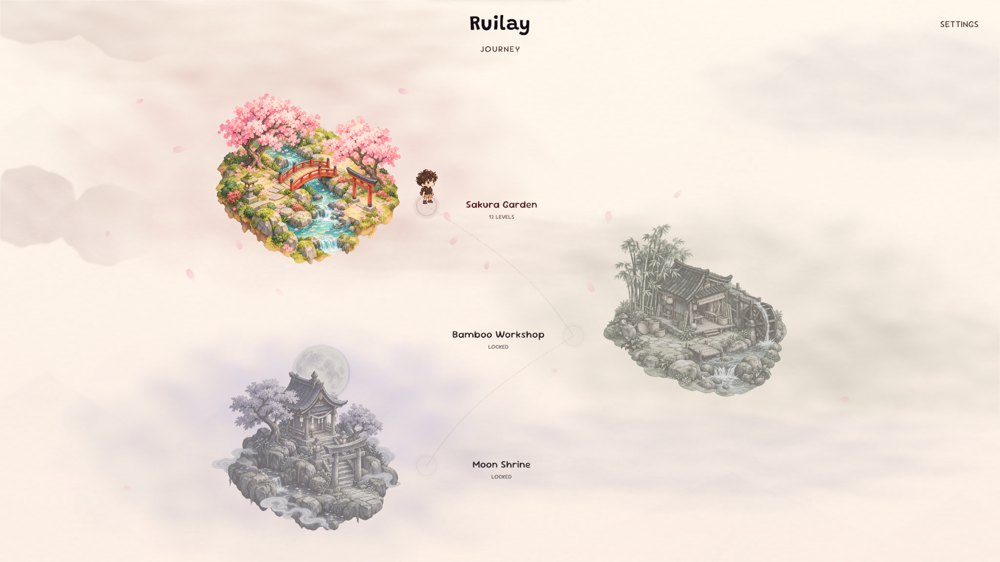
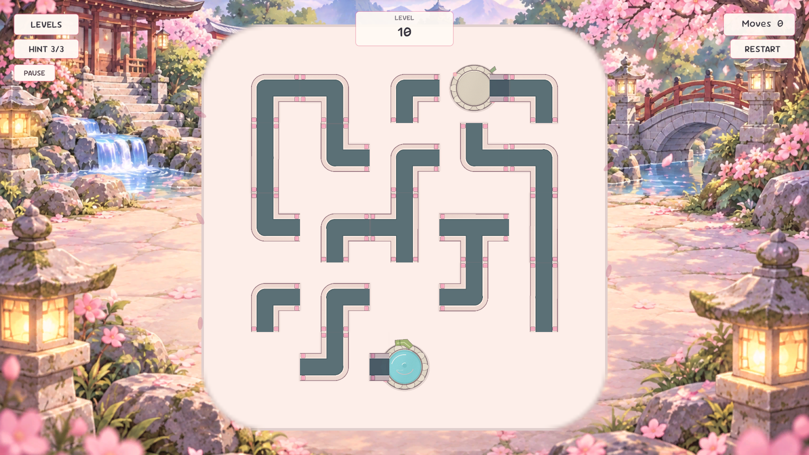
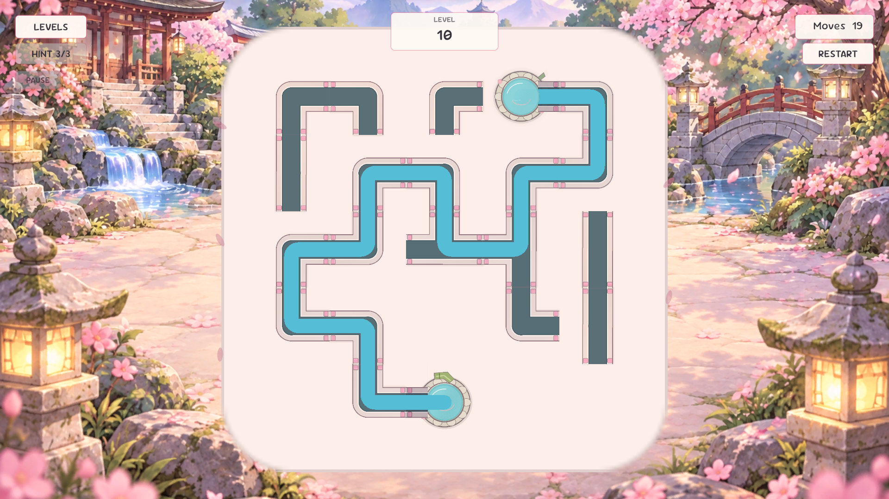
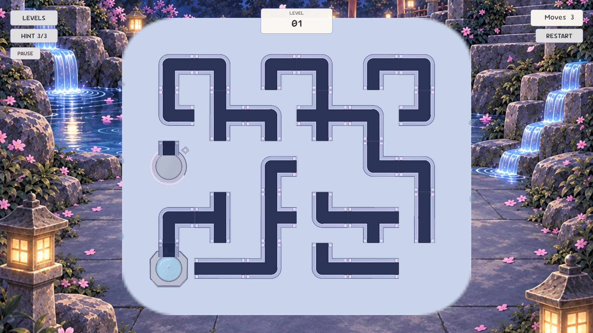
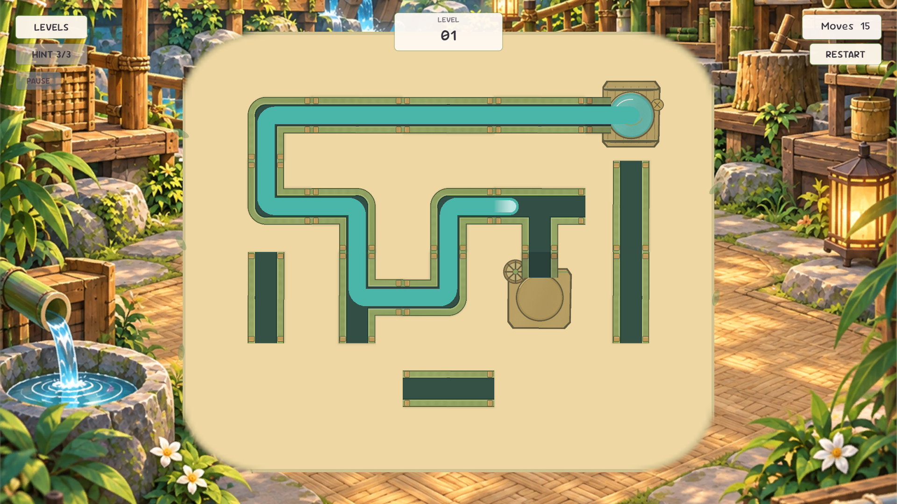

  

<h1 align="center">Ruilay</h1>

  <a href="https://legoshisan.itch.io/ruilay"><strong>itch.io’da oyna / Play on itch.io ↗</strong></a>

  
  
  
  
  

  <a href="#türkçe">Türkçe</a> · <a href="#english">English</a> · <a href="#ekran-görüntüleri--screenshots">Ekran görüntüleri / Screenshots</a> · <a href="#projeyi-çalıştırma">Kurulum</a> · <a href="#architecture">Architecture</a>

---

## Ekran görüntüleri / Screenshots

Sakura çiçeklerinden bambu atölyelerine ve ay ışığındaki tapınaklara uzanan bir su yolculuğu. Aşağıdaki görüntüler oyunun mevcut dünya haritasını, bulmacalarını ve su akışını gösterir.

*A water-flow journey through cherry blossoms, bamboo workshops, and moonlit shrines. These captures show the current world map, puzzles, and flowing water.*

<strong>Üç dünya, 36 bölüm · Three worlds, 36 levels</strong>

| Sakura Garden · Bulmaca / Puzzle | Sakura Garden · Su akışı / Water flow |
| :---: | :---: |
|  |  |
| **Moon Shrine · Ay ışığında / Moonlit puzzle** | **Bamboo Workshop · Su akışı / Water flow** |
|  |  |

---

## Türkçe

### Oyun fikri

Ruilay, Sakura Garden, Bamboo Workshop ve Moon Shrine boyunca geçen sakin ve hikâye odaklı bir su akışı bulmacasıdır. Oyuncu boruları 90 derecelik adımlarla döndürerek kaynaktan hedefe kesintisiz bir rota kurar; tamamlanan rotayı izleyen su akışı bölümü çözer.

Proje şu anda **pre-alpha / oynanabilir temel prototip** aşamasındadır. Sakura Garden, Bamboo Workshop ve Moon Shrine dünyalarında **12'şer bölüm, toplam 36 bölüm** bulunur. Dünya bazlı ilerleme ve 3/6/9/12 story checkpoint'leri korunur. Yeni zorluk eğrisi ve doğrulama ayrıntıları [level design raporundadır](docs/level-design-pass.md).

### Öne çıkan teknik özellikler

- Bit maskeleriyle temsil edilen dört yönlü boru bağlantıları
- Karo şekline ve dönüşüne göre dinamik bağlantı hesabı
- Kilitli karoları destekleyen 90° saat yönü dönüş sistemi
- Başarılı dönüşlerde event üzerinden güncellenen görünür hamle sayacı
- Kaynaktan hedefe ulaşılabilirliği kontrol eden BFS tabanlı bağlantı algoritması
- `ScriptableObject` tabanlı, tekrar kullanılabilir bölüm tanımları
- Bölüm verisini çalışma zamanı durumuna çeviren `BoardBuilder`
- Bölümdeki karoları prefab üzerinden üreten ve grid'i dünya merkezine yerleştiren `BoardView`
- Oluşturulan renderer sınırlarını, ekran oranını ve padding değerini kullanarak kamerayı otomatik ayarlayan `BoardCameraFitter`
- Karo şekline uygun pipe sprite'ını ve dönüşünü görsele uygulayan `TileView`
- `IPointerClickHandler` ve event zinciri üzerinden çalışan tıklama → animasyonlu döndürme → çözüm kontrolü akışı
- Source / Target rol ayrımı, kilitli karo tint'i ve Source'tan ulaşılabilir hatlarda powered görünümü
- Çözüm anında powered hat üzerinde kısa completion pulse geri bildirimi
- Gerçek Source → Target rotasını tile merkezlerinden takip eden enerji projectile / flow animasyonu
- `BoxCollider2D` destekli tile etkileşimi ve kilitli Source/Target kontrolü
- Bölüm çözüldükten sonra yeni tile inputlarını engelleyen tamamlama kilidi
- Her dünyanın 12 bölümünü sunan `LevelSelectUI`, World Map ve comic navigation; yeniden başlatma, bölüm bilgisi, hamle sayacı ve tamamlama panelini yöneten oyun UI'ı
- `PlayerPrefs` ile kalıcı tutulan level açılma ilerlemesi
- İlk Android APK denemesi için hazırlanan build yapılandırması
- Başarılı pipe dönüşünde procedural tick; target'a ulaşan flow tamamlandıktan sonra tek completion chime. `GameFeedback.SetSoundEnabled` ve `SetHapticsEnabled` tercihleri `PlayerPrefs` ile saklar. Android completion titreşimi 40 ms'dir; fiziksel cihaz doğrulaması bekler.

### Mimari

| Katman | Sorumluluk | Başlıca sınıflar |
| --- | --- | --- |
| `Data` | Yön, bağlantı, karo ve bölüm tanımları | `Direction`, `ConnectionMask`, `TileDefinition`, `LevelDefinition` |
| `Board` | Çalışma zamanı tahta durumu ve oyun kuralları | `TileState`, `BoardState`, `BoardBuilder`, `ConnectionChecker` |
| `View` | Karo prefablarının oluşturulması, görsel feedback, çözüm rotası enerji akışı ve kamera uyumu | `BoardView`, `TileView`, `EnergyFlowView`, `BoardCameraFitter`, `TilePrefab` |
| `Gameplay` | Bölüm yükleme, yeniden başlatma, hamle ve ilerleme akışının yönetilmesi | `GameController`, `ProgressService`, `BoardLogicTester` |
| `UI` | Bölüm, hamle ve tamamlama durumlarının ekranda gösterilmesi | `GameUI`, TextMesh Pro, Unity UI |

Bu ayrım sayesinde bölüm verisi, oyun mantığı ve Unity görselleştirmesi birbirinden bağımsız geliştirilebilir.

### Kullanılan teknolojiler

- Unity `6000.3.9f1`
- C#
- Universal Render Pipeline (2D Renderer)
- Unity Input System `1.18.0`
- Unity Test Framework `1.6.0`; EditMode içerik, progression, flow, UI ve audio testleri

## English

### Game concept

Ruilay is a cozy, story-driven water-flow puzzle built with Unity. Journey through three handcrafted worlds — Sakura Garden, Bamboo Workshop, and Moon Shrine — rotating pipes in 90-degree steps to restore a continuous route from source to target. Water follows the completed route to solve each level.

The project is currently in **pre-alpha / playable core prototype** development. Sakura Garden, Bamboo Workshop and Moon Shrine contain **12 levels each, 36 in total**, with world progression and story checkpoints at 3/6/9/12. See the [level design report](docs/level-design-pass.md) for difficulty progression and validation.

### Technical highlights

- Four-direction pipe connections represented with bit masks
- Rotation-aware connection calculation for each tile shape
- Clockwise 90° rotation with locked-tile support
- A visible move counter updated through an event after successful rotations
- BFS-based source-to-target connectivity validation
- Reusable, `ScriptableObject`-based level definitions
- A `BoardBuilder` pipeline that creates runtime state from level data
- A `BoardView` that instantiates prefab-based tiles and centers the grid around the world origin
- A `BoardCameraFitter` that uses renderer bounds, screen aspect ratio, and padding to fit the camera automatically
- A `TileView` that selects the matching pipe sprite and animates its rotation
- A click → animated rotation → solution-check flow built with `IPointerClickHandler` and C# events
- Source / Target role accents, locked-tile tinting, and powered visuals for the route reachable from the Source
- A short completion pulse across the powered route when the puzzle is solved
- An energy projectile / flow animation that follows tile centers along the real Source-to-Target route
- `BoxCollider2D`-based tile interaction with locked Source/Target handling
- A completion lock that prevents additional tile input after the puzzle is solved
- `LevelSelectUI` for each world's twelve levels, World Map and comic navigation, plus gameplay UI for restart, level progress, move count, and completion states
- Persistent level-unlock progress stored with `PlayerPrefs`
- Build configuration prepared for an initial Android APK attempt
- A procedural tick after a successful pipe rotation and a single completion chime after flow reaches the target. `GameFeedback.SetSoundEnabled` and `SetHapticsEnabled` persist preferences through `PlayerPrefs`. Android completion vibration lasts 40 ms; physical-device validation remains pending.

### Architecture

| Layer | Responsibility | Main types |
| --- | --- | --- |
| `Data` | Direction, connection, tile, and level definitions | `Direction`, `ConnectionMask`, `TileDefinition`, `LevelDefinition` |
| `Board` | Runtime board state and game rules | `TileState`, `BoardState`, `BoardBuilder`, `ConnectionChecker` |
| `View` | Tile creation, visual feedback, solved-route energy flow, and camera fitting | `BoardView`, `TileView`, `EnergyFlowView`, `BoardCameraFitter`, `TilePrefab` |
| `Gameplay` | Managing level loading, restart, moves, and progression | `GameController`, `ProgressService`, `BoardLogicTester` |
| `UI` | Presenting level, move, and completion states | `GameUI`, TextMesh Pro, Unity UI |
